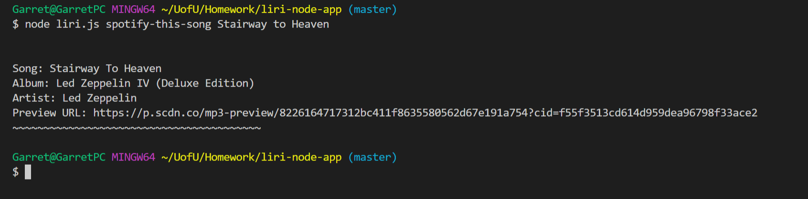
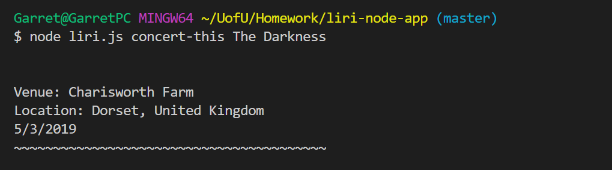
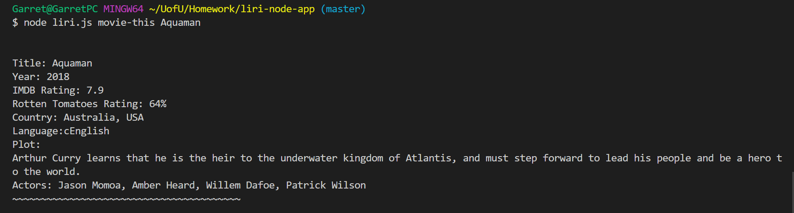
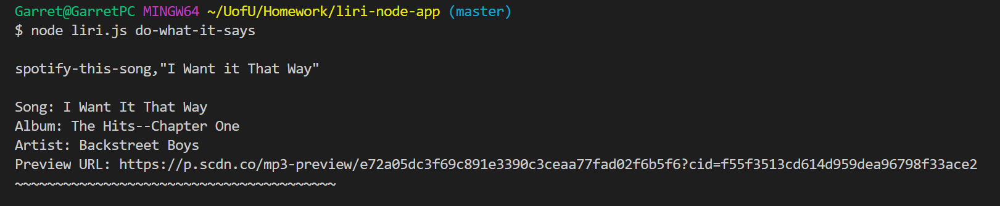

# liri-node-app
## Language Interpretation and Recognition Interface
##### Author: Garret Rueckert
***

## About
LIRI is a command-line Node application that "recognizes" at least 4 commands from users. Liri is connected to the following APIs:

  - ***Spotify*** - track-search, Node specific version of API
  - ***BandsInTown*** - concert search by artist
  - ***OMBD*** - movie database search by title

## How to use LIRI
To use LIRI, simply download the application, set up an .env file with your api keys, and run in the command line with Node. The first argument to LIRI is the command, any following arguments are the search to the relevant APIs. So the console should look something like this:
```
$ node liri.js movie-this The Matrix 
```

#### Valid Commands For LIRI:
  - ***movie-this***
  - ***spotify-this-song***
  - ***concert-this***
  - ***do-what-it-says***

***movie-this*** - will search the OMBD API for a title based on your search and return the movie's 
- Title
- Release year
- IMDB and Rotten Tomatoes Rating
- Country (or countries) of production
- Language
- Plot

***spotify-this-song*** will search the Spotify API for a track based on your search and return 
- Song title
- Album 
- Artist
- Preview URL *(if available)*
- *Search can be refined by adding more info like artist name + the track name*

***concert-this*** will search the BandsInTown API for a concert based on your search (by artist) and return the concert's
- Venue
- Location
- Date

***do-what-it-says*** will input a command to LIRI by reading the file **random.txt**, separating the command from the search by a comma
**Eg.**
```
spotify-this-song,"I Want it That Way"
```

LIRI automatically formats any searches passed as command-line arguments (beyond the initial command input) 

## Tech Used

LIRI uses a variety of node packages to work:

* [Axios](https://www.npmjs.com/package/axios) - Promise based HTTP client for the browser and node.js
* [Moment](https://www.npmjs.com/package/moment) - A lightweight JavaScript date library for parsing, validating, manipulating, and formatting dates.
* [FS](https://nodejs.org/api/fs.html) - Node's built-in file system I/O
* node.js - Runtime environment for the JavaScript
* [dotenv](https://www.npmjs.com/package/dotenv) - Module that loads environment variables from a .env file into process.env
* [node-spotify-api](https://www.npmjs.com/package/node-spotify-api) - node version of hitting the Spotify REST API
* Git - version control and using .gitignore to hide Spotify keys


## Examples






## Todos
- Add a log.txt file and write every command and output to it
- Better format concerts showing and allow users to refine search
- More testing for break-case scenarios
